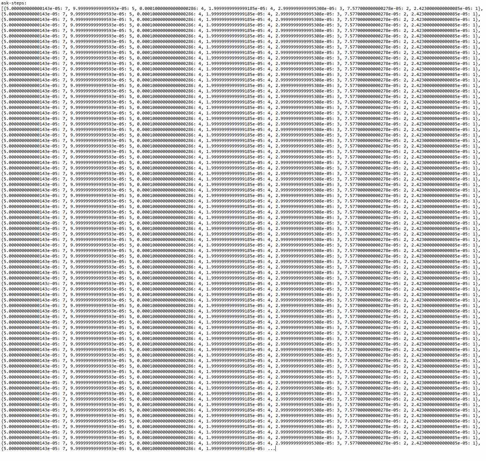
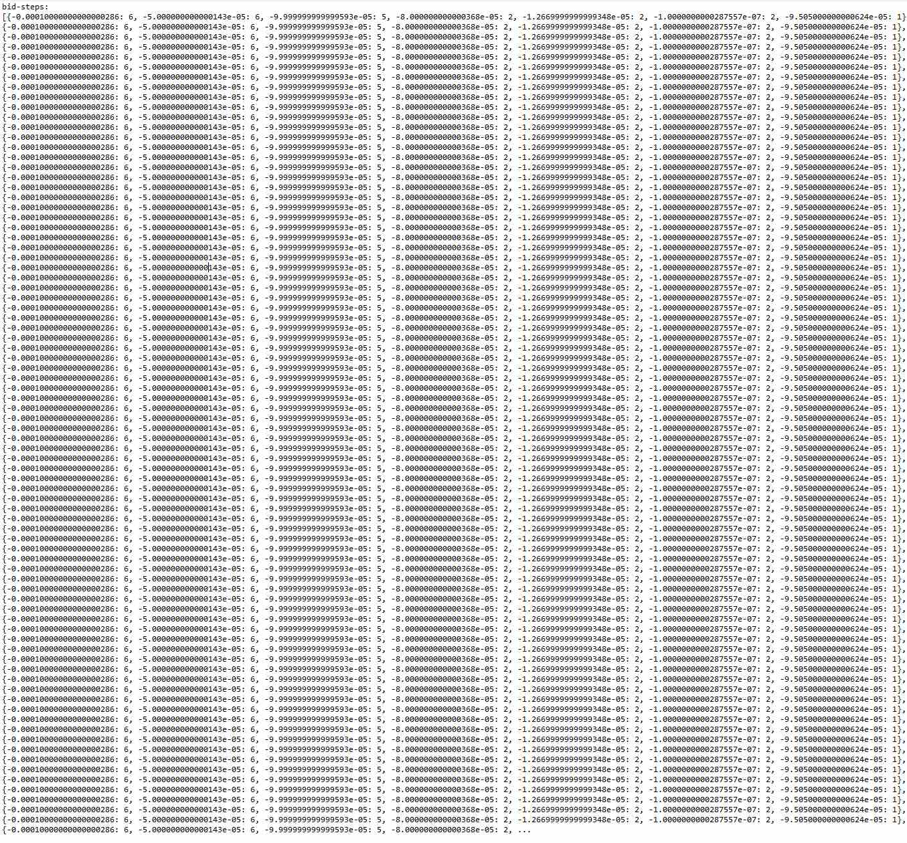

# Market Data Analysis Report 

## Key Findings

### 1. Anomaly with bids- and asks-lists in the Orderbook.
The first acquaintance with the orderbook shows that the length of bids- and asks-lists is the same in every snapshot and is always equal to 50. It looks like it's a truncated version of the orderbook, otherwise it would be very strange.

### 2. The orderbook does not reflect the actual trading volume on the market.
Visual assessment of distribution of bid- and ask-orders shows that almost all of the orderbook's asks are close to 0, there is only one exeption - on the penultimate graph. 

This exeption can be found in the 6th from the end snapshot: '2025-09-03 16:33:30.943424800 ... {'price': 0.03984, 'size': 199.665}, ...'
After looking for it in the 'eth-btc-trades.csv' it was found out that this aks-order was bought at exactly 16:33:30 - the same minute and second it was placed in the orderbook.
It can be seen at the next picture how the ask-distribution looks when '16:33:30'-snapshot is deleted.

The next step was checking the max-values of buy- and sell-trades as well as their volume.
There were 720 BUY-trades and 125 sell-trades totally.

max sell-trade: 0.19106776 ETH;  total volume of sell-trades: 0.9603567500000002 ETH
max buy-trade: 687.32918 ETH;  total volume of buy-trades: 168297.80241572 ETH
Buy-volume is 1.7*10^5 times more than sell-volume.

The distribution of buy-trades:
number of buy-trades less than 0.01ETH: 36 , volume: 0.04649978
number of buy-trades between 0.01 - 0.1ETH: 5 , volume: 0.08919394
number of buy-trades between 0.1 - 1ETH: 0 , volume: 0.0
number of buy-trades between 1 - 10ETH: 1 , volume: 7.485598
number of buy-trades between 10 - 100ETH: 152 , volume: 9824.763454
number of buy-trades exceeding 100ETH: 526 , volume: 158465.41767

For simplicity the total volume of buy-trades was divided into two main groups - transactions less than 10EHT and transactions exceeding 10ETH:

number of buy-trades less than 10ETH: 42 , volume: 7.62129172
number of buy-trades exceeding 10ETH: 678 , volume: 168290.181124

It turns out almost all buy-trades exceeding 10 ETH are out the snapshots (all but the abovementioned '16:33:30'-trade). 

Then it was checked if there were any more cases when a snapshot was taken less than 10 seconds before any buy-trade was executed.

4 buy-cases were discovered:
time of trade: 2025-09-02 01:11:34+00:00
time of snapshot: 2025-09-02 01:11:25.228272300+00:00
time interval: 8 sec.
size of trade: 510.516 ETH

time of trade: 2025-09-02 02:06:15+00:00
time of snapshot: 2025-09-02 02:06:07.126520700+00:00
time interval: 7 sec.
size of trade: 323.52829 ETH

time of trade: 2025-09-02 07:34:59+00:00
time of snapshot: 2025-09-02 07:34:51.396485700+00:00
time interval: 7 sec.
size of trade: 27.151483 ETH

time of trade: 2025-09-03 07:23:21+00:00
time of snapshot: 2025-09-03 07:23:18.802576200+00:00
time interval: 2 sec.
size of trade: 119.4285 ETH

The 4th transaction was made in less than 2 seconds after creating an ask-order, because there is no ask-order of this size in the 07:23:18-snapshot. The 1st, 2nd and 3rd transactions were made in less than 7 - 8 seconds.

There are no similar cases in sell-trades: there are 2 cases when a snapshot was taken less than 10 seconds before, but a required bid was found in both of them. Also 2 sell-trades were checked randomly - both were idendified in previous snapshots.

Now it is necessary to explore the meaning of this finding.
We have 188 snapshots (the length of the orderbook is 188) and 720 buy-trades. 2 of those trades almost coinside in time with snapshots (the time interval is within 2 seconds). These 2 transactions can be considered chosen randomly. The question is what is the probability of the case when 2 randomly chosen trades are executed in less than 2 seconds while the majority of trades is executed in more than 2 seconds?

Let's assume that 80% which is 576 of buy-trades  were executed in more than 2 seconds after placing an order and 20% which is 144 trades - in less than 2 seconds. According to the classical definition of probability and taking into account the formula for the number of combinations, we obtain that probability of having two randomly chosen trades being executed in less than 2 seconds is:
p = (144!/((144-2)!*2!))*(576!/((576-0)!*0!))/(720!/((720-2)!)*2!)=0.0398, which is about 4%.
Therefore we can say with 96%-probability that 20% of buy-trades were executed within 2 seconds after placing orders.

Let's assume that 50% which is 360 of buy-trades were executed in more than 2 seconds and 50% which is 360 trades - in less than 2 seconds. Then probability of having two randomly chosen trades being executed in less than 2 seconds is:
p = (360!/((360-2)!*2!))*(360!/((360-0)!*0!))/(720!/((720-2)!)*2!)=0.2497, which is about 25%.
Therefore we can say with 75%-probability that 50% of buy-trades were executed within 2 seconds after placing orders.

Now the same will be done with all 5 abovementioned cases in which 5 trades are executed in less than 8 seconds after placing orders.

Let's assume that 75% which is 540 of buy-trades were executed in more than 8 seconds and 25% which is 180 trades - in less than 8 seconds. Then probability of having five randomly chosen trades being executed in less than 8 seconds is:
p = (180!/((180-5)!*5!))*(540!/((540-0)!*0!))/(720!/((720-5)!)*5!)=0.00093, which is about 0.09%.
Therefore we can say with 99.91%-probability that 25% of buy-trades were executed within 8 seconds after placing orders.

If we assume that 36.8% which is 265 of buy-trades were executed in more than 8 seconds and 63.2% which is 455 trades - in less than 8 seconds, then probability of having five randomly chosen trades being executed in less than 8 seconds is:
p = (455!/((455-5)!*5!))*(265!/((265-0)!*0!))/(720!/((720-5)!)*5!)=0.09997, which is about 10%.
Therefore we can say with 90%-probability that 63.2% of buy-trades were executed within 8 seconds after placing orders.

### 3. Buy-trades prevailed, but the price was mostly falling.
If 677 out of 678 buy-transactions exceeding 10ETH were executed so quickly that they were out of the orderbook's snapshots the quiestion is: what was their price? Was it always the best price?
The picture below shows the best (green line) and the average (blue line) ask-price from the orderbook's snapshots against the actual price of the buy-trades (red lines).

The actual buy-price is better than what can be seen in the orderbook's snapshots most of the time. Though the best-price-line is always so close to the buying price while this price moving contradicts normal market behaviour because buy-trades significanly prevail. It seems reasonable to check ask-prices on higher levels in the following paragraphs.

The suspicious pattern found in this paragraph: if selling ETH was so successful that all huge offers were bought so quickly, why not to try to sell it at a higher price - place an order into the orderbook and wait for a while? Not even once out of 678 times?

### 4. Orderbook lists are truncated at the end.
To explore the premice of the previous paragraph, all 50 asks and 50 bids (as it was mentioned in the beginning the lenght of orderbook's lists is 50) at every timestamp were visualized. The lowest ask-line (light blue) is the best ask-price at different timestampes, the highest ask-line is the least competitive ask-price. And it's vice versa with the bid-lines (yellow).

It can be seen that ask-lines and bid-lines shift relative to some level from time to time, almost all of them. It is because the majority of asks and bids is mostly the same, so for example when a new ask is added to a list which is almost the same (or removed from a list) - all higher ask-offers shift on one level.
But ask- and bid-lines shift back to the same levels from time to time as well.

To explain this observation it is interesting to consider the following asks from three snapshots:
2025-09-02 14:54:24 ... {'price': 0.04192, 'size': 0.00024652}, {'price': 0.04197, 'size': 0.00024694}, {'price': 0.04197577, 'size': 0.01199991}, {'price': 0.042, 'size': 0.00474414}, {'price': 0.04202, 'size': 0.00023971}, {'price': 0.04207, 'size': 0.00023942}, {'price': 0.0421, 'size': 0.0025}, ... 

2025-09-03 03:07:03 ... {'price': 0.04192, 'size': 0.00024652}

2025-09-03 19:55:17 ... {'price': 0.04192, 'size': 0.00024652}, {'price': 0.04197, 'size': 0.00024694}, {'price': 0.04197577, 'size': 0.01199991}, {'price': 0.04199, 'size': 0.00027}, {'price': 0.042, 'size': 0.00474414}, {'price': 0.04202, 'size': 0.00023971}, {'price': 0.04207, 'size': 0.00023942}, {'price': 0.0421, 'size': 0.0025}

This part "{'price': 0.04192, 'size': 0.00024652}" is common for every timestamp. But for 03:07 timestamp it is the ending (the last 50th ask). Whereas in 14:54 timestamp there are higher price levels. And at 19:55 these levels are back again. Actually not just price levels but  absolutely identical asks: {'price': 0.04197, 'size': 0.00024694}, {'price': 0.04197577, 'size': 0.01199991}, {'price': 0.042, 'size': 0.00474414}, {'price': 0.04202, 'size': 0.00023971}, {'price': 0.04207, 'size': 0.00023942}, {'price': 0.0421, 'size': 0.0025}.

It is very likely that this is where orderbook lists were truncated: at the end.

Bid-prices from snapshots:
2025-09-01 03:52:04 ... {'price': 0.0377, 'size': 0.00311485}, {'price': 0.03763159, 'size': 0.02189266}, {'price': 0.0376, 'size': 0.00438429}]"

2025-09-01 05:05:14 ... {'price': 0.0377, 'size': 0.00311485}]"

2025-09-01 08:07:49 ... {'price': 0.0377, 'size': 0.00311485}, {'price': 0.03763159, 'size': 0.02189266}]"

2025-09-01 14:32:14 ... {'price': 0.0377, 'size': 0.00311485}, {'price': 0.03763159, 'size': 0.02189266}, {'price': 0.0376, 'size': 0.00438429}, {'price': 0.03759, 'size': 0.00205824}]"

The list is truncated at 05:05 and partially at 08:07-snapshot, but at 03:52 and 14:32 longer versions can be seen.
The same pattern can be checked at timeframes between 11p.m. September 1 - 2a.m. September 2 and 6a.m. - 1p.m. September 2 (I checked the lists - it's the same). So bid-lists the same as ask-lists are truncated at the end. 

### 5. The same trend that contradicts normal market behaviour is discovered both in the trades-file and orderbook.
It can be seen (figure 5) that not just best ask-prices followed the buying price moving, but also many asks were added at price levels that followed the same trend at the timeframe from 9p.m September 1 till 9a.m. September 3. It contradicts normal market behaviour, where price is rising if buying-trades significantly prevail.

### 6. Many steps between price-levels in asks and bids are repeated.
Some adjasent asks-lines (figure 5) have approximately the same distances between each other as well as bid-lines. The ask- and bid-lists were checked to see if the step between adjasent price levels was indeed the same in many cases. It turned out this was the case, but I also discovered that 3 steps were repeated in both asks and bids.  

Most likely it means that 26 out of 50 asks (those that have a repeated step between each other) and 24 out of 50 of bids at every timestamp were created by the same participant.
Now if we look at the ask-lines between 9p.m September 1 - 9a.m. September 3 considered in the previous paragraph, a step between many of them is repeated (for example, steps between levels 0 - 13 and 0 - 20 were checked in script.py for snapshots 2025-09-01 21:32:25 and 2025-09-02 21:18:41 respectively). Therefore many of the asks whose existence contradicts normal market behaviour were most likely created by the abovementioned participant.

### 7. Sell-trades amounting to 46% of the total sell-volume were carried ot at a less favourable price than they could have been.
There are 3 sell-cases (they were found visually at figure 5 and identified in the trade-file and orderbook) with volume of 46.6% of the total sell-volume where difference between sell-price and best bid-price is many times more than an average step between bid-price levels: 
2025-09-01 07:22:53+00:00,0.04096094,0.011677,SELL
2025-09-01 07:22:55+00:00,0.04096094,0.02023365,SELL
2025-09-01 07:22:57+00:00,0.04096094,0.19106776,SELL

2025-09-02 01:16:00+00:00,0.03978426,0.01407185,SELL

2025-09-03 12:22:27+00:00,0.03947808,0.00245322,SELL
2025-09-03 12:22:27+00:00,0.03947808,0.12188391,SELL
2025-09-03 12:22:30+00:00,0.03947808,0.07891418,SELL
2025-09-03 12:22:31+00:00,0.03947808,0.00772631,SELL

It is worth noting that even if the difference was much smaller these would still be the best bid-prices, but also the trades would be more profitable.

### 8. Simultaneous changes in bid- and ask-lists.
One more strange pattern was noticed. Most of the time the majority of bid- and ask-lines at figure 5 are parallel to the time axis, which means there are no changes in these price levels of ask- and bid-lists. But there are at least 10 simultaneous shifts of majority of bid- and ask-lines which means there are 10 simultaneous changes in lists of asks and bids. Most of them coinside in time with a sharp change in buying price, but some do not coinside with the price movement and coinside only with each other: for example at around 4a.m, between 1p.m. - 2p.m. and at around 5 p.m. on September 1. It strengthens the assumption that many actions in the orderbook were performed by the same participant.

### 8. Additional notes.
Not only ask-prices on many levels followed the buying-price movements, but also bid-prices on several levels, which is very much like normal market behaviour, but again, there were bid-lines with repeated steps on levels that were removed after price falling. So removing those bids was executed by the same abovementioned participant.
Moreover it was found out, that some of the removed bids, were placed back at exactly the same price levels later when price recovered. But it should be checked by exploring more orderbooks whether this behaviour pattern is normal or not in the market.  

## Conclusion
There was a market participant who placed at least half of asks and almost half of bids and added and removed many asks and bids following the buying price movement. But this movement contradicted normal market behaviour because the price was mostly falling, while the volume on the buying side was 99.9%. Therefore it can be assumed that there was a connection between trading and orderbook filling.