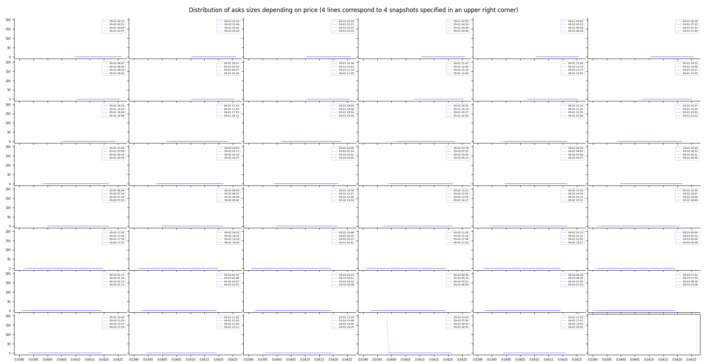
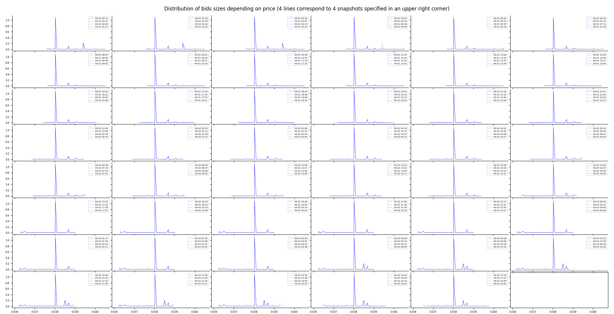
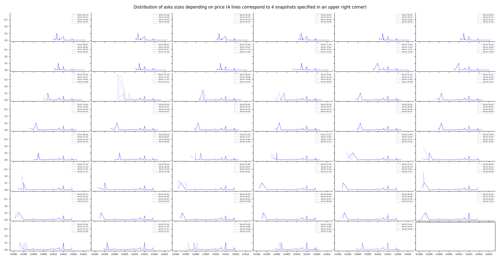
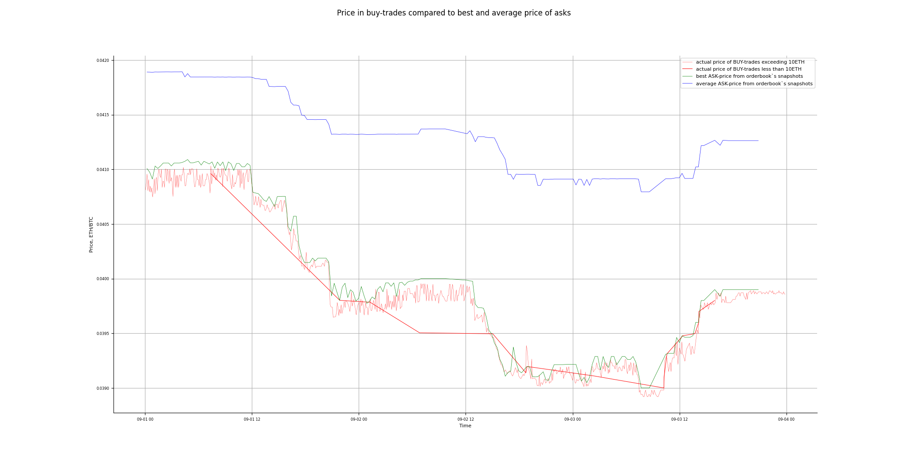

# Market Data Analysis Report 

## Key Findings

### Anomaly with bids- and asks-lists in the Orderbook.
The first acquaintance with the orderbook shows that the length of bids- and asks-lists is the same in every snapshot and is always equal to 50. It looks like we have a truncated version of the orderbook, otherwise it would be very strange.

### The orderbook does not reflect the actual trading volume on the market.
Visual assessment of distribution of bid- and ask-orders shows that almost all of the orderbook's asks are close to 0, there is only one exeption - on the penultimate graph. 

This exeption can be found in the 6th from the end snapshot: '2025-09-03 16:33:30.943424800 ... {'price': 0.03984, 'size': 199.665}, ...'
After looking for it in the 'eth-btc-trades.csv' it was found out that this aks-order was bought at exactly 16:33:30 - the same minute and second it was placed in the orderbook.
It can be seen at the next picture how the ask-distribution looks when '16:33:30'-snapshot is deleted.

The next step was checking the max-values of buy- and sell-trades as well as their distribution.
There were 720 BUY-trades and 125 sell-trades totally.

max sell-trade: 0.19106776 ETH;  total volume of sell-trades: 0.9603567500000002 ETH
max buy-trade: 687.32918 ETH;  total volume of buy-trades: 168297.80241572 ETH

The total volume of sell-trades is insignificant, what can be interesting is the distribution of buy-trades:

number of buy-trades less than 0.01ETH: 36 , volume: 0.04649978
number of buy-trades between 0.01 - 0.1ETH: 5 , volume: 0.08919394
number of buy-trades between 0.1 - 1ETH: 0 , volume: 0.0
number of buy-trades between 1 - 10ETH: 1 , volume: 7.485598
number of buy-trades between 10 - 100ETH: 152 , volume: 9824.763454
number of buy-trades exceeding 100ETH: 526 , volume: 158465.41767

For simplicity the total volume of buy-trades was divided into two main groups - transactions less than 10EHT and transactions exceeding 10ETH:

number of buy-trades less than 10ETH: 42 , volume: 7.62129172
number of buy-trades exceeding 10ETH: 678 , volume: 168290.181124

It turns out almost all buy-trades exceeding 10 ETH are out the snapshots (all but the abovementioned '16:33:30'-trade). 

Then it is necessary to check whether there were other similar cases, for example, when a snapshot was taken less than 10 seconds before a buy-trade of over 10 ETH was carried out. 
4 cases were discovered:

time of trade: 2025-09-02 01:11:34+00:00
time of snapshot: 2025-09-02 01:11:25.228272300+00:00
time interval: 8 sec.
size of trade: 510.516 ETH

time of trade: 2025-09-02 02:06:15+00:00
time of snapshot: 2025-09-02 02:06:07.126520700+00:00
time interval: 7 sec.
size of trade: 323.52829 ETH

time of trade: 2025-09-02 07:34:59+00:00
time of snapshot: 2025-09-02 07:34:51.396485700+00:00
time interval: 7 sec.
size of trade: 27.151483 ETH

time of trade: 2025-09-03 07:23:21+00:00
time of snapshot: 2025-09-03 07:23:18.802576200+00:00
time interval: 2 sec.
size of trade: 119.4285 ETH

The 4th transaction was made in less than 2 seconds after creating an ask-order, because there is no ask-order of this size in the 07:23:18-snapshot. The 1st, 2nd and 3rd transactions were made in less than 7 - 8 seconds.

The conclusion of this paragraph is: the prevailed majority of buy-trades was most likely executed within seconds or splits of seconds after placing orders.

### Price in buy-trades against the best and average ask-price from orderbook's snapshots.
If 677 out of 678 buy-transactions exceeding 10ETH were executed so quickly that they were out of the orderbook's snapshots the quiestion is: what was their price? Was it always the best price?
The picture below shows the best (green line) and the average (blue line) ask-price from the orderbook's snapshots against the actual price of the buy-trades (red lines).

The actual buy-price is really better than what can be seen in the orderbook's snapshots most of the time. Which can be a normal market behaviour, though it looks like guys with the best price are always so close... It seems reasonable to check the rest ask-prices. But the suspicious part here is this: if selling ETH was so successful that all huge offers were bought so quickly, why not to try to sell it at a higher price - place an order into the orderbook and wait for a while? Not even once out of 678 times?

### Ask- and bid-prices from orderbook's snapshots compared to each other.
To explore the premice from the previous paragraph, all 50 asks and 50 bids (as it was mentioned in the beginning the lenght of orderbook's lists is 50) at every timestamp were visualized. The lowest ask-line (light blue) is the best ask-price at different timestampes, the highest ask-line is the least competitive ask-price. And it's vice versa with the bid-lines (yellow).

It can be seen that ask-lines and bid-lines are shifted relative to each other - almost all of them. It is because the majority of asks and bids is mostly the same, so for example when an ask with a new price is added to a list - all higher ask-lines get shifted on one level.
It is interesting to consider the ask-lines and ask-prices in four intervals of time: between September 1 21:00 and September 2 06:00, September 2 between 13:00 and 15:00, then after price dropping - between September 2 20:00 and September 3 11:00 and the final interval - September 3 after 17:00.

Ask-prices from snapshots:
2025-09-02 00:16:35 ... {'price': 0.04192, 'size': 0.00024652}, {'price': 0.04197, 'size': 0.00024694}, {'price': 0.04197577, 'size': 0.01199991}, {'price': 0.042, 'size': 0.00474414}, {'price': 0.04202, 'size': 0.00023971}, {'price': 0.04207, 'size': 0.00023942}, {'price': 0.0421, 'size': 0.0025}, ... 

2025-09-02 14:36:07 ... {'price': 0.04192, 'size': 0.00024652}, {'price': 0.04197, 'size': 0.00024694}, {'price': 0.04197577, 'size': 0.01199991}, {'price': 0.042, 'size': 0.00474414}, {'price': 0.04202, 'size': 0.00023971}, {'price': 0.04207, 'size': 0.00023942}, {'price': 0.0421, 'size': 0.0025}, ... 

2025-09-02 14:54:24 ... {'price': 0.04192, 'size': 0.00024652}, {'price': 0.04197, 'size': 0.00024694}, {'price': 0.04197577, 'size': 0.01199991}, {'price': 0.042, 'size': 0.00474414}, {'price': 0.04202, 'size': 0.00023971}, {'price': 0.04207, 'size': 0.00023942}, {'price': 0.0421, 'size': 0.0025}, ... 

2025-09-02 21:36:57 ... {'price': 0.04192, 'size': 0.00024652}

2025-09-03 03:07:03 ... {'price': 0.04192, 'size': 0.00024652}

2025-09-03 19:55:17 ... {'price': 0.04192, 'size': 0.00024652}, {'price': 0.04197, 'size': 0.00024694}, {'price': 0.04197577, 'size': 0.01199991}, {'price': 0.04199, 'size': 0.00027}, {'price': 0.042, 'size': 0.00474414}, {'price': 0.04202, 'size': 0.00023971}, {'price': 0.04207, 'size': 0.00023942}, {'price': 0.0421, 'size': 0.0025}

2025-09-03 20:50:36 ... {'price': 0.04192, 'size': 0.00024652}, {'price': 0.04197, 'size': 0.00024694}, {'price': 0.04197577, 'size': 0.01199991}, {'price': 0.04199, 'size': 0.00027}, {'price': 0.042, 'size': 0.00474414}, {'price': 0.04202, 'size': 0.00023971}, {'price': 0.04207, 'size': 0.00023942}, {'price': 0.0421, 'size': 0.0025}

This part "{'price': 0.04192, 'size': 0.00024652}" is common for every timestamp. But for 21:36 and 03:07 timestamps it is the ending. Whereas in  00:16, 14:36 and 14:54 timestamps there are higher price levels. And at 19:55 and 20:50 these levels are back again. Actually not just price levels but  absolutely identical asks: {'price': 0.04197, 'size': 0.00024694}, {'price': 0.04197577, 'size': 0.01199991}, {'price': 0.042, 'size': 0.00474414}, {'price': 0.04202, 'size': 0.00023971}, {'price': 0.04207, 'size': 0.00023942}, {'price': 0.0421, 'size': 0.0025}.

It is unlike normal human behaviour, but it is very likely that this is the part where the orderbook was truncated: from the ending of the lists. At least there are no competitive prices in the ends of the ask-lists.

It is different with the bid-lists though.
Bid-prices from snapshots:
2025-09-02 14:36:07 ... {'price': 0.03939782, 'size': 0.00229782}, {'price': 0.0393, 'size': 0.00261679}, {'price': 0.03925777, 'size': 0.00246826}, {'price': 0.0392, 'size': 0.00287474}, {'price': 0.0391, 'size': 0.0028757}, {'price': 0.03907353, 'size': 0.04093716}, {'price': 0.03900577, 'size': 0.01444284}, 
{'price': 0.0390001, 'size': 0.00027}, ... 
{'price': 0.0389, 'size': 0.00287763}, {'price': 0.03885, 'size': 0.00025997}...

2025-09-02 14:54:24 ... {'price': 0.03939782, 'size': 0.00229782}, {'price': 0.0393, 'size': 0.00261679}, {'price': 0.03925777, 'size': 0.00246826}, {'price': 0.0392, 'size': 0.00287474}, {'price': 0.0391, 'size': 0.0028757}, {'price': 0.03907353, 'size': 0.04093716}, {'price': 0.03900577, 'size': 0.01444284}, 
{'price': 0.0390001, 'size': 0.00027}, ... {'price': 0.0389, 'size': 0.00287763}, {'price': 0.03885, 'size': 0.00025997}...

2025-09-02 17:02 {'price': 0.03900577, 'size': 0.01444284}, {'price': 0.0390001, 'size': 0.00027}, {'price': 0.039, 'size': 0.00287435}...

2025-09-03 03:25 {'price': 0.0390001, 'size': 0.00027}, ... {'price': 0.0389, 'size': 0.00287763}, {'price': 0.03885, 'size': 0.00025997}...

2025-09-03 07:05 {'price': 0.0390001, 'size': 0.00027}, ... {'price': 0.0389, 'size': 0.00287763}, {'price': 0.03885, 'size': 0.00025997} ...

2025-09-03 15:56 ... {'price': 0.03939782, 'size': 0.00230517}, {'price': 0.0393, 'size': 0.00254605}, {'price': 0.03925777, 'size': 0.00247084}, {'price': 0.0392, 'size': 0.00255229}, {'price': 0.0391, 'size': 0.00255882}, 
{'price': 0.0389, 'size': 0.00025964}, {'price': 0.03885, 'size': 0.00025997}...

2025-09-03 20:50 ... {'price': 0.03939782, 'size': 0.00230517}, {'price': 0.0393, 'size': 0.00254605}, {'price': 0.03925777, 'size': 0.00247084}, {'price': 0.0392, 'size': 0.00255229}, {'price': 0.0391, 'size': 0.00255882}, 
{'price': 0.0389, 'size': 0.00025964}, {'price': 0.03885, 'size': 0.00025997}...

Snapshots at 03:25 and 07:05 begin with the price 0.0390001 - it's the best price here, and it's the second best in the 17:02-snapshot. This price can be seen in earlier snapshots too, though there are better prices: 0.03939782, 0.0393, 0.03925777, 0.0392, 0.0391. The same prices are back in the last two snapshots at 15:56 and 20:50. But why would people cancel they bids at these prices when the buy-price dropped under 0.0392 and then the same or other people would place their bids at the exactly same prices after the buy-price has been restored? Or maybe bid-lists were truncated from the beginning and then important data is missing. 

## Conclusion
My suggestion is it was artificial trading and orderbook manipulation.